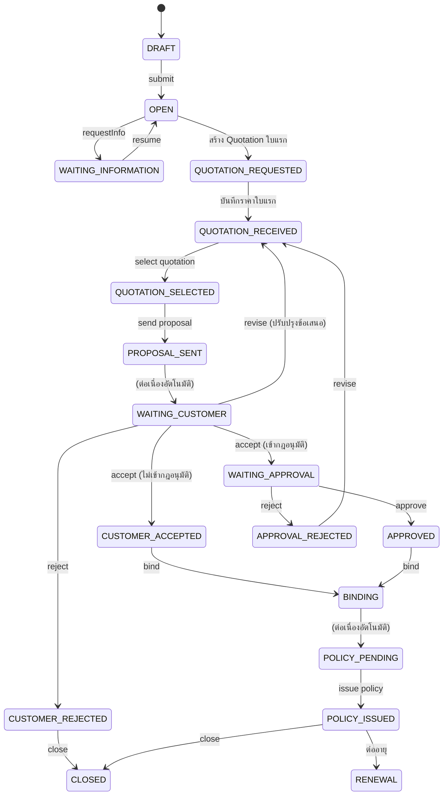

# Flow การทำงานทั้งระบบ — Insurance Opening System V1

> เอกสารนี้สรุปจาก **โค้ดจริงของ backend** (state machine, service, permission) ณ วันที่ 8 ต.ค. 2569 เพื่อใช้ตรวจว่าระบบทำงานถูกต้องหรือไม่
> ส่วนที่เขียนว่า "คาดหวัง" คือสิ่งที่โค้ดกำหนดไว้ ยังไม่ได้ยืนยันด้วยการกดทดสอบทุกข้อ ใช้ Checklist ในหัวข้อ 9 เป็นตัวตรวจ
> เอกสารเดิม [TESTING_FLOW.md](TESTING_FLOW.md) มีบางจุดไม่ตรงกับโค้ด ดูหัวข้อ 10

---

## 1. ภาพรวม

```
Customer → Job → (Risk/Coverage/Documents) → Submit → Quotation → Select → Proposal
        → ลูกค้าตอบรับ → (Approval ตามกฎ) → Binding → Policy → Payment / Commission → Renewal
```

| ชั้น | หน้าที่ |
|---|---|
| Frontend (Angular, :4200) | แสดงผล ปุ่มแสดงตาม `allowedActions` / `canRenew` ที่ backend ส่งมา ไม่ตัดสิน business rule เอง |
| Backend (NestJS, :3000/api) | state machine, กติกาธุรกิจ, permission, audit, transaction |
| ฐานข้อมูล | PostgreSQL (:5433) เงินเก็บ `Decimal(15,2)` ส่งเป็น string เวลาแสดงผล `Asia/Bangkok` |
| อื่น ๆ | Redis (คิว/ตัวตั้งเวลา), Mailpit :8025 (อีเมลทดสอบ) |

---

## 2. State machine ของ Job



- **ยกเลิก (CANCELLED)** ได้จากทุกสถานะ ยกเว้น `POLICY_ISSUED`, `CANCELLED`, `CLOSED`, `EXPIRED`, `RENEWAL` ต้องกรอกเหตุผล และต้องมีสิทธิ์ `job.cancel`
- สถานะปลายทาง (ไปต่อไม่ได้): `CANCELLED`, `CLOSED`, `EXPIRED`, `RENEWAL`
- `DRAFT → QUOTATION_SELECTED` และ `OPEN → QUOTATION_SELECTED` / `QUOTATION_REQUESTED → QUOTATION_SELECTED` มีใน state machine (ทางลัด) แต่หน้าจอปกติใช้เส้นทางหลักข้างบน
- ปุ่มที่ผู้ใช้เห็นต่อสถานะ (จาก `allowedActions`):

| สถานะ | Action | สิทธิ์เพิ่มเติมที่ต้องมี |
|---|---|---|
| DRAFT | submit | `job.submit` |
| OPEN | requestInfo, requestQuotation | `quotation.create` (สำหรับ requestQuotation) |
| WAITING_INFORMATION | resume | — |
| QUOTATION_REQUESTED | recordQuotation | `quotation.update` |
| QUOTATION_RECEIVED | selectQuotation | `quotation.select` |
| QUOTATION_SELECTED | sendProposal | — (และต้องมีสิทธิ์ `proposal.create`/`proposal.send` ที่ endpoint) |
| WAITING_CUSTOMER | acceptProposal, rejectProposal, revise | `proposal.accept` / `proposal.reject` / `proposal.create` (revise) |
| WAITING_APPROVAL | approve | `approval.approve` (ผู้อนุมัติไม่ต้องเป็นเจ้าของ Job) |
| APPROVAL_REJECTED | revise | `proposal.create` |
| CUSTOMER_ACCEPTED, APPROVED | bind | `policy.create` ที่ endpoint |
| POLICY_PENDING | issuePolicy | `policy.create` ที่ endpoint |
| POLICY_ISSUED, CUSTOMER_REJECTED | close | — |
| ทุกสถานะที่ยกเลิกได้ | cancel | `job.cancel` |

ทุก action ยกเว้น `approve` ต้องเป็น "เจ้าของ Job" (Agent ของ Job) หรือมี `job.update_all` (BR-014)

---

## 3. บทบาทและสิทธิ์ (ตามค่า seed ปัจจุบัน)

Login ทดสอบ: `admin`, `agent`, `agent01`, `staff`, `supervisor`, `manager`, `finance`, `viewer` รหัสผ่าน `Password@123`

| ความสามารถ | ADMIN | AGENT | BROKER_STAFF | SUPERVISOR | MANAGER | FINANCE | VIEWER |
|---|:-:|:-:|:-:|:-:|:-:|:-:|:-:|
| ดูข้อมูลทั้งหมด (`*.view`) | ✅ | ✅ (Job เฉพาะของตัวเอง) | ✅ | ✅ | ✅ | ✅ | ✅ |
| ดู Job ทุกคน (`job.view_all`) | ✅ | ❌ | ✅ | ✅ | ✅ | ✅ | ✅ |
| สร้างลูกค้า/แก้/ลบ | ✅ | ✅ | ✅ | ✅ | ❌ | ❌ | ❌ |
| สร้าง Job (`job.create`) | ✅ | ✅ (เฉพาะ Agent = ตัวเอง) | ❌ | ✅ | ❌ | ❌ | ❌ |
| แก้ Job ตัวเอง / ทุกคน | ✅/✅ | ✅/❌ | ✅/✅ | ✅/✅ | ❌ | ❌ | ❌ |
| Submit Job (`job.submit`) | ✅ | ✅ | ❌ | ✅ | ❌ | ❌ | ❌ |
| ยกเลิก Job (`job.cancel`) | ✅ | ✅ | ❌ | ✅ | ✅ | ❌ | ❌ |
| มอบหมาย Job (endpoint ตรวจ `job.update`) | ✅ | ✅ (Job ตัวเอง) | ✅ | ✅ | ❌ | ❌ | ❌ |
| ขอ/บันทึกใบเสนอราคา | ✅ | ❌ | ✅ | ❌ | ❌ | ❌ | ❌ |
| เลือกใบเสนอราคา (`quotation.select`) | ✅ | ✅ | ✅ | ✅ | ❌ | ❌ | ❌ |
| สร้าง/ส่ง/ตอบรับ Proposal | ✅ | ✅ | ✅ | ❌ | ❌ | ❌ | ❌ |
| ขอ/จัดการ Approval (`approval.manage`) | ✅ | ✅ | ✅ | ✅ | ✅ | ❌ | ❌ |
| อนุมัติ (`approval.approve`) | ✅ | ❌ | ❌ | ❌ | ✅ | ❌ | ❌ |
| อนุมัติคำขอของตัวเอง (`approval.approve_own`) | ✅ (เฉพาะ non-production) | ❌ | ❌ | ❌ | ❌ | ❌ | ❌ |
| Bind / ออกกรมธรรม์ (`policy.create`) | ✅ | ❌ | ✅ | ❌ | ❌ | ❌ | ❌ |
| บันทึกชำระเงิน (`payment.create`) | ✅ | ❌ | ❌ | ❌ | ❌ | ✅ | ❌ |
| บันทึก Commission (`commission.create`) | ✅ | ❌ | ❌ | ❌ | ❌ | ✅ | ❌ |
| ต่ออายุ (`renewal.create`) | ✅ | ❌ | ✅ | ❌ | ❌ | ❌ | ❌ |
| สร้าง/แก้ Task | ✅ | ✅ | ✅ | ✅ | ❌ | ❌ | ❌ |
| Import Excel (`import.create`) | ✅ | ❌ | ✅ | ❌ | ❌ | ❌ | ❌ |
| รายงาน/Dashboard ผู้บริหาร (`report.view`) | ✅ | ❌ | ❌ | ✅ | ✅ | ✅ | ✅ |
| ข้อมูลหลัก (`master.manage`), ผู้ใช้ (`user.manage`) | ✅ | ❌ | ❌ | ❌ | ❌ | ❌ | ❌ |
| เห็นเลขบัตร/Tax ID เต็ม (`customer.view_sensitive`) | ✅ | ❌ | ❌ | ✅ | ✅ | ❌ | ❌ |

> สิทธิ์ใน seed เป็นข้อสมมติ (PLAN.md Open Question Q9) ถ้าธุรกิจจริงต่างจากนี้ให้แก้ที่ `seed-data.ts`
> สิทธิ์ `job.assign` ที่ MANAGER/SUPERVISOR มี **ไม่ถูกใช้ตรวจที่ endpoint** (`POST /jobs/:id/assign` ตรวจ `job.update`) จึงทำให้ MANAGER มอบหมาย Job ไม่ได้
> ข้อควรสังเกต: **BROKER_STAFF ไม่มี `job.submit` / `job.create` / `job.cancel`** (ต่างจากที่ TESTING_FLOW.md เขียน)

---

## 4. Flow หลักทีละขั้น (Happy path)

ใช้ `admin` ได้ทุกขั้น หรือแยกบทบาทตามคอลัมน์ "ผู้ทำ"

| # | ขั้นตอน | ผู้ทำ (ขั้นต่ำ) | Endpoint | เงื่อนไข / กติกา | ผลลัพธ์ที่คาดหวัง |
|---|---|---|---|---|---|
| 1 | สร้างลูกค้า | AGENT, STAFF, SUP, ADMIN | `POST /customers` | บุคคล: ชื่อ-นามสกุล / นิติบุคคล: ชื่อบริษัท | ได้ `customerCode` (CUS-…) |
| 2 | สร้าง Job | AGENT, SUP, ADMIN | `POST /jobs` | Agent สร้างได้เฉพาะ Agent = ตัวเอง; เลือกประเภท/ผลิตภัณฑ์/วันคุ้มครอง | สถานะ `DRAFT`, ได้ `JOB-ปี-000xxx` |
| 3 | กรอกความเสี่ยง | เจ้าของ Job / STAFF | `PUT /jobs/:id/risk` | แก้ได้เฉพาะ DRAFT, OPEN, WAITING_INFORMATION; ฟิลด์ตามผลิตภัณฑ์; ผิดรูปแบบ → 422 `VALIDATION_FAILED` | บันทึกค่าความเสี่ยง |
| 4 | เพิ่มความคุ้มครอง | เจ้าของ Job / STAFF | `POST /jobs/:id/coverages` | ระบุทุนประกัน/ค่าเสียหายส่วนแรก | มีรายการคุ้มครอง |
| 5 | อัปโหลดเอกสาร | เจ้าของ Job / STAFF | `POST /jobs/:id/documents` | อัปโหลดได้ทุกสถานะ ยกเว้น CANCELLED/CLOSED/EXPIRED; ดูรายการที่ต้องมีที่ `…/documents/checklist` | เอกสารขึ้นในแท็บเอกสาร |
| 6 | **Submit** | AGENT, SUP, ADMIN | `POST /jobs/:id/submit` | ต้องกรอก **ฟิลด์ความเสี่ยงที่จำเป็นครบ** ไม่ครบ → 422 `JOB_RISK_INCOMPLETE`; ถ้าผลิตภัณฑ์ตั้ง `requireDocsOnSubmit` (เช่น MOTOR) ต้องมีเอกสารที่จำเป็นครบ ไม่ครบ → 422 `JOB_DOCUMENTS_MISSING` | `DRAFT → OPEN` |
| 6a | ขอข้อมูลเพิ่ม (ถ้ามี) | STAFF, ADMIN | `POST /jobs/:id/request-info` → `/resume` | วนกลับ OPEN ได้ | `OPEN ⇄ WAITING_INFORMATION` |
| 7 | ขอใบเสนอราคา | STAFF, ADMIN | `POST /jobs/:id/quotations` | 1 บริษัทประกัน/1 Job (ซ้ำ → 400 `QUOTATION_COMPANY_DUPLICATE`) | ใบแรก: `OPEN → QUOTATION_REQUESTED`, quotation สถานะ `REQUESTED`, สร้าง Task "ติดตามใบเสนอราคา" |
| 8 | บันทึกราคา / เวอร์ชันใหม่ | STAFF, ADMIN | `PUT /quotations/:id`, `POST /quotations/:id/versions` | บันทึกราคาครั้งแรก (`PUT`) หรือปรับปรุงราคาเป็นเวอร์ชันใหม่ (`POST .../versions`); เวอร์ชันเก่ากลายเป็น `SUPERSEDED`; รองรับการถอน (`POST .../withdraw` → `WITHDRAWN`); คำนวณเบี้ยและดึง commissionRate จาก master ตาม `quotationDate` | ใบแรกที่ได้ราคา: `→ QUOTATION_RECEIVED`, quotation `RECEIVED` (v1, v2, ...) |
| 9 | เปรียบเทียบ + เลือก | AGENT, STAFF, SUP, ADMIN | `GET /jobs/:id/quotation-comparison`, `POST /quotations/:id/select` | ดูตารางเปรียบเทียบหลายมิติจากเวอร์ชันล่าสุด (highlight `isLowest`); quotation ต้อง `RECEIVED`, **ไม่หมดอายุ** (`validUntil` ≥ วันนี้เวลาไทย) และต้องเลือกเวอร์ชันล่าสุด; บันทึกเหตุผลในการเลือก | `→ QUOTATION_SELECTED`, quotation `SELECTED` |
| 10 | สร้าง + ส่ง Proposal | AGENT, STAFF, ADMIN | `POST /jobs/:id/proposal`, `POST /proposals/:id/send` | Job ต้อง `QUOTATION_SELECTED`; ผูก `QuotationVersion` และ `PaymentTerm` (เงื่อนไขชำระเงิน/งวดผ่อน); Proposal มีเวอร์ชันต่อ Job (v1, v2); ดู PDF พร้อมงวดผ่อนที่ `GET /proposals/:id/pdf` | Proposal `DRAFT → SENT`; Job `→ PROPOSAL_SENT → WAITING_CUSTOMER` (อัตโนมัติ); สร้าง Task "ติดตามผลการนำเสนอลูกค้า" |
| 10a | ปรับปรุงข้อเสนอ (Revise) | AGENT, STAFF, ADMIN | `POST /jobs/:id/revise`, `POST /proposals/:id/revise` | เรียกได้จากสถานะ `WAITING_CUSTOMER` หรือ `APPROVAL_REJECTED`; ระบุเหตุผล; มาร์ก Proposal ปัจจุบันเป็น `SUPERSEDED`, ยกเลิก Approval ที่ค้างเป็น `CANCELLED`, ถอย Quotation ที่เลือกเป็น `RECEIVED` | Job ถอยกลับสู่ `QUOTATION_RECEIVED` เพื่อเลือกหรือบันทึกราคาใหม่และออก Proposal v2 |
| 11a | ลูกค้า**ยอมรับ** (Acceptance Evidence) | AGENT, STAFF, ADMIN | `POST /proposals/:id/accept` | Proposal ต้อง `SENT` และไม่เกิน `validUntil`; บันทึก `acceptedByName`, `method` (EMAIL/SIGNED_DOCUMENT/LINE/MANUAL); กฎ: method ≠ MANUAL ต้องมีไฟล์หลักฐาน (multipart `file` หรือ `evidenceFileId`), MANUAL ต้องมี `remark` (ไม่ตรง → 422 `ACCEPTANCE_EVIDENCE_REQUIRED`); ส่งแจ้งเตือน `CUSTOMER_ACCEPTED` | ระบบประเมิน **กฎอนุมัติ** (ดู 5.2): เข้ากฎ → สร้าง Approval `PENDING` + Job `→ WAITING_APPROVAL`; ไม่เข้ากฎ → `→ CUSTOMER_ACCEPTED` |
| 11b | ลูกค้า**ปฏิเสธ** | AGENT, STAFF, ADMIN | `POST /proposals/:id/reject` | ระบุ `rejectReason` (PRICE/COVERAGE/COMPETITOR/CUSTOMER_CANCELLED/NO_RESPONSE/OTHER); ส่งแจ้งเตือน `CUSTOMER_REJECTED` | Proposal `REJECTED`, Job `→ CUSTOMER_REJECTED` แล้ว `close` → `CLOSED` |
| 12 | **อนุมัติ** | MANAGER, ADMIN | `POST /approvals/:id/approve` (หรือ `/reject`) | ดู 5.2: ห้ามอนุมัติคำขอของตัวเอง (422 `APPROVAL_SELF_APPROVE`) ยกเว้นมี `approve_own`; ระดับ role ต้อง ≥ ประเภทที่ขอ (SUPERVISOR < MANAGER < ADMIN) ไม่พอ → 403 | Approval `APPROVED`, Job `→ APPROVED` |
| 13 | **Bind** | STAFF, ADMIN | `GET /jobs/:id/bind/preconditions`, `POST /jobs/:id/bind` | Job ต้อง `CUSTOMER_ACCEPTED`/`APPROVED`; ต้องมี quotation ที่เลือก (BR-006), Proposal ที่ลูกค้ารับ (BR-007), ไม่มี Approval ค้าง (BR-009), เอกสารครบถ้าผลิตภัณฑ์ตั้ง `requireDocsOnBind` (BR-008); รองรับ `Idempotency-Key` | สร้าง Binding; Job `→ BINDING → POLICY_PENDING` (อัตโนมัติ) |
| 14 | **ออกกรมธรรม์** | STAFF, ADMIN | `POST /jobs/:id/policy` | Job ต้อง `POLICY_PENDING`; **เลขกรมธรรม์ระบบออกให้เอง**; เบี้ย/ความคุ้มครองคัดลอกจาก quotation ที่เลือก | Policy สถานะ `ISSUED`; Job `→ POLICY_ISSUED` |
| 15 | บันทึกชำระเงิน | FINANCE, ADMIN | `POST /policies/:id/payments` | จำนวน > 0; รวมแล้วเกินเบี้ยไม่ได้ (422 `PAYMENT_EXCEEDS_PREMIUM`, BR-011); ยกเลิกรายการได้ (`…/cancel`) ไม่ลบ | สถานะการชำระคำนวณจากยอด: UNPAID / PARTIAL / PAID / OVERDUE (ดู 5.3) |
| 16 | บันทึก Commission | FINANCE, ADMIN | `POST /policies/:id/commission` | **กรอกฐานและอัตราเอง** ระบบคำนวณจำนวนเงิน (ฐาน × อัตรา) | มีรายการ commission |
| 17 | ปิดงาน / ต่ออายุ | STAFF, ADMIN | `POST /jobs/:id/close` หรือดูหัวข้อ 6 | — | `CLOSED` หรือ `RENEWAL` |

---

## 5. กติกาสำคัญ

### 5.1 การคำนวณเบี้ย (ใบเสนอราคา)
- เบี้ยสุทธิ (net) = เบี้ยรวม (gross) − ส่วนลด
- อากรแสตมป์ = **ปัดขึ้น**(net × 0.004)
- ภาษี = ปัด 2 ตำแหน่ง((net + อากร) × 0.07)
- ยอดรวม = net + อากร + ภาษี (ติดลบไม่ได้ → 422 `QUOTATION_TOTAL_NEGATIVE`)
- อากรและภาษีแก้ทับค่าอัตโนมัติได้ถ้าส่งมา

ตัวอย่าง: gross 8,000, ส่วนลด 0 → net 8,000, อากร 32, ภาษี 562.40, รวม 8,594.40

### 5.2 กฎอนุมัติ (Approval)
ตอน "ลูกค้ายอมรับ" ระบบเทียบกฎที่เปิดใช้งานกับเบี้ยสุทธิและส่วนลด% ถ้าเข้าหลายกฎ ใช้ผู้อนุมัติ**ระดับสูงสุด**

กฎใน seed:

| กฎ | เงื่อนไข | ผู้อนุมัติ |
|---|---|---|
| 1 | เบี้ยสุทธิ < 100,000 | SUPERVISOR |
| 2 | เบี้ยสุทธิ ≥ 100,000 | MANAGER |
| 3 | ส่วนลด > 10% | MANAGER |

ผลที่ตามมา: **กฎ 1 และ 2 ครอบคลุมเบี้ยทุกจำนวน ดังนั้นทุก Proposal ที่ลูกค้ายอมรับจะต้องผ่านการอนุมัติเสมอ** (เส้นทาง `CUSTOMER_ACCEPTED → BINDING` เกิดได้เมื่อปิดกฎใน Master data เท่านั้น) — ตรวจว่าตรงกับที่ธุรกิจต้องการหรือไม่

การอนุมัติ:
- ระดับ role: SUPERVISOR(1) < MANAGER(2) < ADMIN(3) — คนที่ระดับสูงกว่าอนุมัติแทนระดับต่ำได้ แต่ SUPERVISOR ใน seed **ไม่มีสิทธิ์ `approval.approve`** จึงอนุมัติเองไม่ได้ ต้องใช้ MANAGER/ADMIN
- Maker-checker: ผู้ขอ (requestedBy) อนุมัติ/ปฏิเสธเองไม่ได้ ยกเว้นมีสิทธิ์ `approval.approve_own` (ADMIN ในโหมด non-production เท่านั้น)

### 5.3 สถานะการชำระเงิน (คำนวณ ไม่ได้เก็บเป็นสถานะ)
- ชำระครบ (ยอดที่ ACTIVE ≥ เบี้ยรวม) → **PAID**
- ยังค้าง และเลย `paymentDueDate` → **OVERDUE**
- มีชำระบางส่วน → **PARTIAL**
- ไม่มีเลย → **UNPAID**

### 5.4 กติกาอื่น
| รหัส | กติกา |
|---|---|
| BR-006 | Bind/สร้าง Proposal ต้องมี quotation ที่เลือก |
| BR-007 | Bind ต้องมี Proposal ที่ลูกค้ายอมรับ |
| BR-008 | Bind ต้องมีเอกสารครบถ้าผลิตภัณฑ์กำหนด |
| BR-009 | Bind ไม่ได้ถ้ามี Approval ค้าง |
| BR-011 | ชำระเกินเบี้ยไม่ได้ (สิทธิ์ `payment.overpay` ยังไม่มีใน role ใดเลย) |
| BR-013 | ต่ออายุซ้ำไม่ได้ถ้ามี Job ต่ออายุของกรมธรรม์นั้นอยู่แล้ว (409) |
| BR-014 | Agent เห็น/แก้เฉพาะ Job ตัวเอง |
| ทั่วไป | ทุก status change ผ่าน `JobWorkflowService` พร้อม optimistic lock (409 `CONCURRENT_MODIFICATION`), ประวัติสถานะ และ audit log |
| ทั่วไป | ห้ามลบข้อมูลธุรกรรมจริง: Payment ยกเลิกเป็น CANCELLED, ลูกค้า/Job/ข้อมูลหลักใช้ soft delete |
| ทั่วไป | ลบ quotation ไม่ได้ถ้าถูกเลือก/ถูก Proposal/Binding/Policy อ้างอิงแล้ว |

---

## 6. Flow การต่ออายุ (Renewal)

**ที่มาของรายการต่ออายุ**
1. **อัตโนมัติ**: ตัวตั้งเวลารายวัน (BullMQ) ตรวจกรมธรรม์สถานะ `ISSUED` ที่จะหมดอายุในอีก **90, 60, 30 และ 7 วัน** → สร้างรายการต่ออายุสถานะ `PENDING` + Task ประเภท RENEWAL (ความสำคัญ: ≤7 วัน URGENT, ≤30 วัน HIGH, อื่น ๆ MEDIUM) รันซ้ำไม่สร้างซ้ำ
2. **กดเอง**: เรียก `POST /policies/:id/renew` ได้เลยแม้ยังไม่มีรายการ (ระบบสร้างรายการให้)

**กดปุ่ม "ต่ออายุ"** (หน้า ต่ออายุประกัน)
- ปุ่มแสดงเมื่อ backend ส่ง `canRenew = true`: สถานะ PENDING / IN_PROGRESS / QUOTATION / CUSTOMER_CONTACTED / ACCEPTED, ยังไม่มี Job ใหม่, กรมธรรม์เป็น `ISSUED`, และผู้ใช้มี `renewal.create`
- Dialog แสดงวันเริ่ม/สิ้นสุดที่ backend แนะนำ (เริ่มวันสิ้นสุดเดิม อายุเท่าเดิม นับตามปฏิทิน) แก้ได้; สิ้นสุดต้องหลังเริ่ม (422 `RENEWAL_INVALID_DATES`)
- ผลลัพธ์:
  - Job ใหม่สถานะ `DRAFT`, `source = RENEWAL`, ผูก `previousPolicyId`
  - คัดลอก: ลูกค้า, ประเภท/ผลิตภัณฑ์, Agent, ผู้รับผิดชอบ, priority, ความเสี่ยง, ความคุ้มครอง, เอกสารลูกค้า (ID_CARD, COMPANY_REGISTRATION, TAX_DOCUMENT, VEHICLE_BOOK, VEHICLE_PHOTO, RISK_SURVEY, OTHER — ชี้ไฟล์เดิม)
  - **ไม่**คัดลอก: quotation, proposal, policy, payment, เอกสารประเภท PREVIOUS_POLICY/INVOICE/RECEIPT
  - Job เดิม `POLICY_ISSUED → RENEWAL`; Task ประเภท RENEWAL ที่ค้างของ Job เดิมถูกปิดเป็น DONE
  - รายการต่ออายุเป็น `IN_PROGRESS` พร้อมผูก Job ใหม่
  - ระบบพาไปหน้า Job ใหม่ ซึ่งมีการ์ด "ต่ออายุจากกรมธรรม์เดิม" (กรมธรรม์, บริษัทประกัน, เบี้ย, ระยะเวลาเดิม)
- จากนั้น Job ใหม่เดินตาม Flow หลักตั้งแต่ขั้น 3 (Submit → … )

---

## 7. Flow รอง

| เรื่อง | พฤติกรรม |
|---|---|
| ยกเลิก Job | `POST /jobs/:id/cancel` ต้องกรอกเหตุผล; ใช้ได้ตามข้อจำกัดในหัวข้อ 2 |
| มอบหมาย Job | `POST /jobs/:id/assign` → สร้าง Task "โทรติดต่อลูกค้า" และแจ้งเตือน `JOB_ASSIGNED` ให้ผู้รับ |
| Task | สร้างเอง (`POST /jobs/:id/tasks`), ทำเสร็จ/ยกเลิก (`/tasks/:id/complete`, `/cancel`); Task อัตโนมัติจากการขอใบเสนอราคา, ส่ง Proposal, มอบหมาย, ต่ออายุ |
| แจ้งเตือน | `GET /notifications`, นับที่ยังไม่อ่าน, อ่านรายการ/อ่านทั้งหมด (ตอนนี้โค้ดสร้างแจ้งเตือนจริงเฉพาะ "มอบหมายงาน" — ดูหัวข้อ 10) |
| Dashboard | `agent` (ต้องมี `job.view`), `manager` และ `funnel` (ต้องมี `report.view`) |
| Export Excel | jobs, quotations, policies, payments, commissions, renewals (ต้องมี `report.view`) |
| Import Excel | ดาวน์โหลด template; นำเข้า customers, customer-addresses, jobs (ต้องมี `import.create`) |
| ข้อมูลหลัก | ประเภท/ผลิตภัณฑ์/บริษัทประกัน/ความคุ้มครอง/ฟิลด์ความเสี่ยง/เอกสารที่ต้องมี/กฎอนุมัติ — อ่านได้ทุกคนที่ login, แก้ต้องมี `master.manage` |
| ผู้ใช้ | จัดการผู้ใช้/บทบาท/รีเซ็ตรหัสผ่าน ต้องมี `user.manage` |
| โปรไฟล์บริษัท | ข้อมูลหัวกระดาษที่พิมพ์บน PDF ของ Proposal |

เมนูหน้าเว็บ: dashboard, customers, jobs, quotations, approvals, policies, payments, commissions, tasks, renewals, imports, master, users

---

## 8. สถานะของเอกสารย่อย

| เอกสาร | สถานะที่เป็นไปได้ |
|---|---|
| Quotation | REQUESTED → RECEIVED → SELECTED (หรือ REJECTED / EXPIRED / CANCELLED) |
| Proposal | DRAFT → SENT → ACCEPTED / REJECTED (หรือ VIEWED / EXPIRED) |
| Approval | PENDING → APPROVED / REJECTED (หรือ CANCELLED) |
| Policy | ออกแล้วเป็น `ISSUED` (ค่าอื่นใน enum: PENDING, ACTIVE, CANCELLED, EXPIRED, RENEWED) |
| Payment | ACTIVE / CANCELLED |
| Commission | CALCULATED (ค่าเริ่มต้น) → APPROVED / PAID / CANCELLED |
| Task | TODO → IN_PROGRESS → DONE / CANCELLED |
| Renewal | PENDING → IN_PROGRESS → QUOTATION → CUSTOMER_CONTACTED → ACCEPTED → RENEWED (หรือ REJECTED / LOST / CANCELLED) |

---

## 9. Checklist ตรวจสอบ

ทำตามลำดับ ติ๊กเมื่อพฤติกรรมตรงกับ "ผลลัพธ์ที่คาดหวัง"

**A. Flow หลัก**
- [ ] A1 `agent01` สร้างลูกค้า + Job (Agent = ตัวเอง) → `DRAFT` (ถ้าหน้าสร้าง Job โหลดรายชื่อผู้ใช้ไม่ได้ ซึ่งเป็นข้อจำกัด P2-1 ใน TESTING_FLOW ให้ใช้ `admin` แทน)
- [ ] A2 กรอกความเสี่ยง/ความคุ้มครอง/เอกสาร → Submit สำเร็จ `OPEN`
- [ ] A3 Submit โดยไม่กรอกฟิลด์จำเป็น → ถูกปฏิเสธ 422 พร้อมระบุฟิลด์
- [ ] A4 `staff` ขอใบเสนอราคา 2 บริษัท → ใบแรก `QUOTATION_REQUESTED`, ใบที่สองไม่เปลี่ยนสถานะ, บริษัทซ้ำถูกปฏิเสธ
- [ ] A5 บันทึกราคา → `QUOTATION_RECEIVED`; ตัวเลขอากร/ภาษี/รวมตรงสูตรข้อ 5.1
- [ ] A6 เลือกใบเสนอราคา → `QUOTATION_SELECTED`; เลือกใบที่หมดอายุถูกปฏิเสธ
- [ ] A7 สร้าง + ส่ง Proposal → `WAITING_CUSTOMER`; เปิด PDF ได้; มีอีเมลใน Mailpit (ถ้าเปิดใช้)
- [ ] A8 ลูกค้ายอมรับ → `WAITING_APPROVAL` (ตามกฎ seed ต้องเข้าอนุมัติเสมอ)
- [ ] A9 `manager` อนุมัติ → `APPROVED`; ผู้ขอ (non-admin) อนุมัติเองถูกปฏิเสธ
- [ ] A10 Bind โดยไม่มี Proposal ที่รับ/มี Approval ค้าง → ถูกปฏิเสธ; ปกติ → `POLICY_PENDING`
- [ ] A11 ออกกรมธรรม์ → `POLICY_ISSUED`, ได้เลขกรมธรรม์อัตโนมัติ, เบี้ยตรง quotation
- [ ] A12 `finance` บันทึกชำระ: บางส่วน → PARTIAL; ครบ → PAID; เกิน → ถูกปฏิเสธ; ยกเลิกรายการได้
- [ ] A13 `finance` บันทึก Commission → จำนวนเงิน = ฐาน × อัตรา

**B. ปฏิเสธ / ยกเลิก**
- [ ] B1 ลูกค้าปฏิเสธต้องระบุเหตุผล → `CUSTOMER_REJECTED` → ปิดงาน `CLOSED`
- [ ] B2 ยกเลิก Job ต้องใส่เหตุผล; `POLICY_ISSUED` ยกเลิกไม่ได้
- [ ] B3 ขอข้อมูลเพิ่ม ⇄ ดำเนินการต่อ

**C. สิทธิ์ / ขอบเขตข้อมูล**
- [ ] C1 `agent` เห็นเฉพาะ Job ตัวเอง, `staff`/`viewer` เห็นทุก Job
- [ ] C2 `staff` ไม่เห็นปุ่ม Submit/ยกเลิก; `viewer` ไม่มีปุ่ม action ใด ๆ
- [ ] C3 ปุ่มบนหน้าจอเปลี่ยนตามสถานะและบทบาท (ไม่มี `PUT {status}`)
- [ ] C4 เลขบัตร/Tax ID ถูกปิดบังสำหรับบทบาทที่ไม่มี `customer.view_sensitive`

**D. ต่ออายุ**
- [ ] D1 หน้าต่ออายุแสดงเลขกรมธรรม์/ลูกค้า/ผลิตภัณฑ์/เบี้ย (ไม่ใช่ UUID)
- [ ] D2 ปุ่ม "ต่ออายุ" เห็นเฉพาะ `admin`/`staff` และเฉพาะแถวที่ `canRenew`
- [ ] D3 กดต่ออายุ → dialog → ยกเลิกแล้ว dialog ปิด
- [ ] D4 ยืนยัน → พาไป Job ใหม่ (`DRAFT`), มีการ์ดอ้างอิง, ปุ่มย้อนกลับใช้ได้
- [ ] D5 Job ใหม่มีความเสี่ยง/ความคุ้มครอง/เอกสารลูกค้า/ผู้รับผิดชอบเหมือนเดิม; วันที่ตรงที่เลือก
- [ ] D6 Job เดิมเป็น `RENEWAL`; Task RENEWAL ค้างของ Job เดิมเป็น DONE (Task อื่นไม่เปลี่ยน)
- [ ] D7 กดต่ออายุซ้ำ → 409; ใส่วันสิ้นสุดก่อนวันเริ่ม → 422
- [ ] D8 Job ต่ออายุเดินต่อจนออกกรมธรรม์ใหม่ได้

**E. อื่น ๆ**
- [ ] E1 มอบหมาย Job → เกิด Task + แจ้งเตือนให้ผู้รับ
- [ ] E2 Task อัตโนมัติเกิดตอนขอใบเสนอราคา/ส่ง Proposal
- [ ] E3 Export Excel ได้ทั้ง 6 รายงาน, Import template ใช้งานได้
- [ ] E4 เปลี่ยนสถานะพร้อมกัน 2 หน้าจอ → ฝั่งหลังได้ 409 และโหลดข้อมูลใหม่
- [ ] E5 ประวัติ (Timeline) บันทึกทุกการเปลี่ยนสถานะและ action สำคัญ

---

## 10. จุดที่ควรตรวจ / ไม่ตรงกับเอกสารเดิม

**ที่ [TESTING_FLOW.md](TESTING_FLOW.md) เขียนไม่ตรงกับโค้ด**
1. BROKER_STAFF ทำ Submit/ยกเลิก **ไม่ได้** (ไม่มี `job.submit`, `job.cancel`) — ต้องเป็น AGENT/SUPERVISOR/ADMIN
2. เลขกรมธรรม์ **ระบบออกให้เอง** ไม่ได้กรอกเอง; วันคุ้มครองของ Policy มาจาก Job
3. Commission **ไม่ได้คำนวณจากอัตราของผลิตภัณฑ์อัตโนมัติ** — Finance กรอกฐานและอัตราเอง
4. Approval ไม่ได้เป็นขั้นที่ทำเอง: เกิดอัตโนมัติตอนลูกค้ายอมรับ และตามกฎ seed จะเกิด**ทุกครั้ง**
5. "ปิดงาน" ใช้ได้ที่ `POLICY_ISSUED` และ `CUSTOMER_REJECTED` เท่านั้น

**ข้อสังเกตจากการอ่านโค้ด (ยังไม่ได้ยืนยันด้วยการทดสอบ ควรตัดสินใจว่าเป็นพฤติกรรมที่ต้องการหรือไม่)**
- **ตรวจ 1 — Binding.effectiveDate**: ตอน Bind ใช้ "วันที่ใบเสนอราคา" (ไม่ใช่วันเริ่มคุ้มครองของ Job) เป็นวันที่มีผลของ Binding ส่วน Policy ใช้วันเริ่ม/สิ้นสุดของ Job
- **ตรวจ 2 — การแจ้งเตือน**: enum มี 10 ประเภท (เอกสารขาด, ได้รับใบเสนอราคา, ต้องอนุมัติ, ออกกรมธรรม์, ค้างชำระ, ใกล้ครบกำหนด Task/ต่ออายุ ฯลฯ) แต่โค้ดเรียกสร้างแจ้งเตือนเพียงจุดเดียว (มอบหมายงาน)
- **ตรวจ 3 — สถานะ Policy**: ออกแล้วเป็น `ISSUED` และไม่เปลี่ยนเมื่อชำระครบ/ต่ออายุ/หมดอายุ (ค่า ACTIVE, EXPIRED, RENEWED ใน enum ไม่ถูกตั้งที่ไหน); Job `EXPIRED` ไม่มีเส้นทางเข้า
- **ตรวจ 4 — Commission**: สร้างสถานะ `CALCULATED` แล้วไม่มี endpoint เปลี่ยนเป็น APPROVED/PAID (ในรายการมี `paidDate` ให้กรอกตอนสร้างเท่านั้น); ไม่ผูกกับการชำระเบี้ยครบ
- **ตรวจ 5 — ชำระเกินเบี้ย**: ต้องมี `payment.overpay` แต่ไม่มี role ไหนได้สิทธิ์นี้ จึงชำระเกินไม่ได้เลย (ถ้าต้องการอนุญาตต้องเพิ่มสิทธิ์)
- **ตรวจ 6 — ต่ออายุอัตโนมัติ**: ตัวตั้งเวลาสร้างเฉพาะ "รายการ + Task" ไม่ได้สร้าง Job ต่ออายุให้ ต้องกดปุ่มเอง และการแจ้งเตือน `RENEWAL_DUE` ยังไม่ถูกส่ง
- **ตรวจ 7 — ข้อมูลตัวอย่าง**: seed "Demo Renewal" และ `db:seed:mock` สร้างข้อมูลตรงเข้า DB ไม่ผ่าน workflow จึงไม่มีประวัติสถานะ (Timeline) ของ Job เหล่านั้น

---

## 11. คำสั่งที่ใช้ตอนทดสอบ

```bash
docker compose up -d                       # postgres / redis / mailpit
npm run dev                                # API :3000 + Web :4200
npm run db:seed                            # ข้อมูลหลัก + ผู้ใช้ตัวอย่าง
npm run db:seed:mock -w apps/api           # Job ตัวอย่างทุกสถานะ
npm run db:seed:mock:renewal -w apps/api   # ข้อมูลต่ออายุ + Task ตัวอย่าง
npm run test -w apps/api                   # unit test
npm run test:e2e -w apps/api               # e2e (ใช้ DB insurance_test)
```
