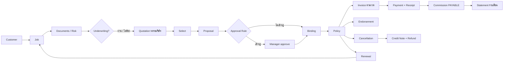
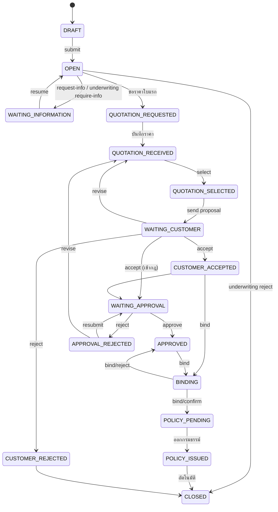
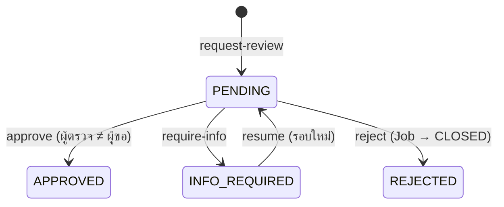
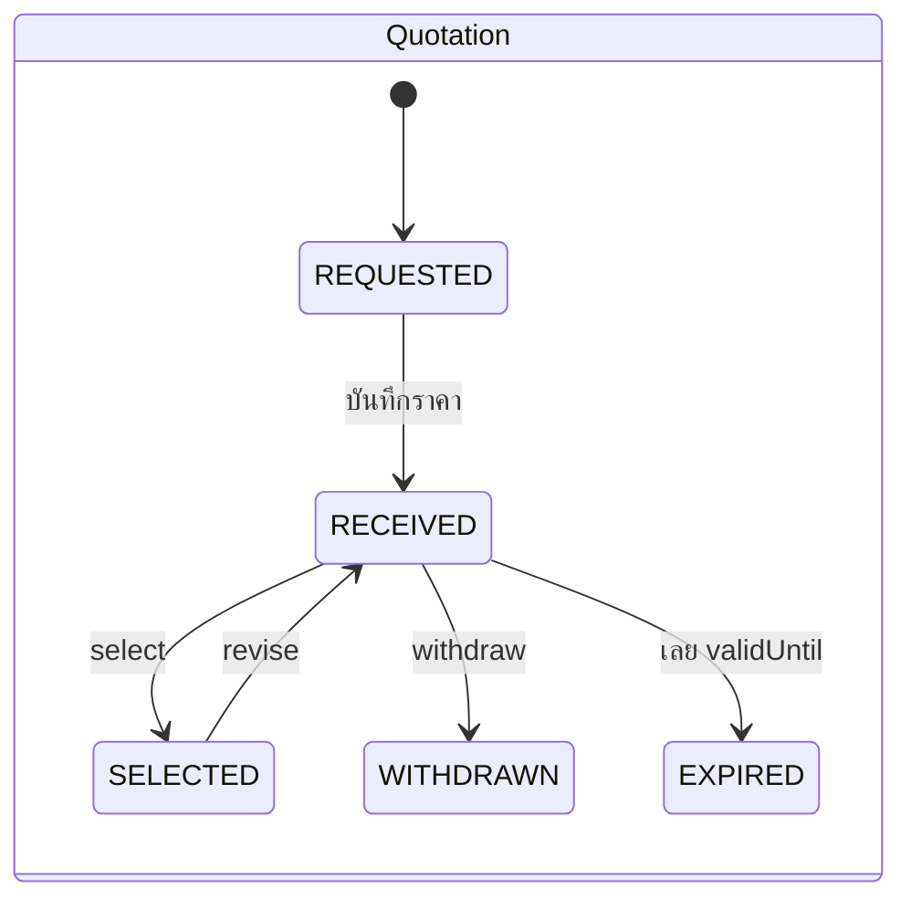
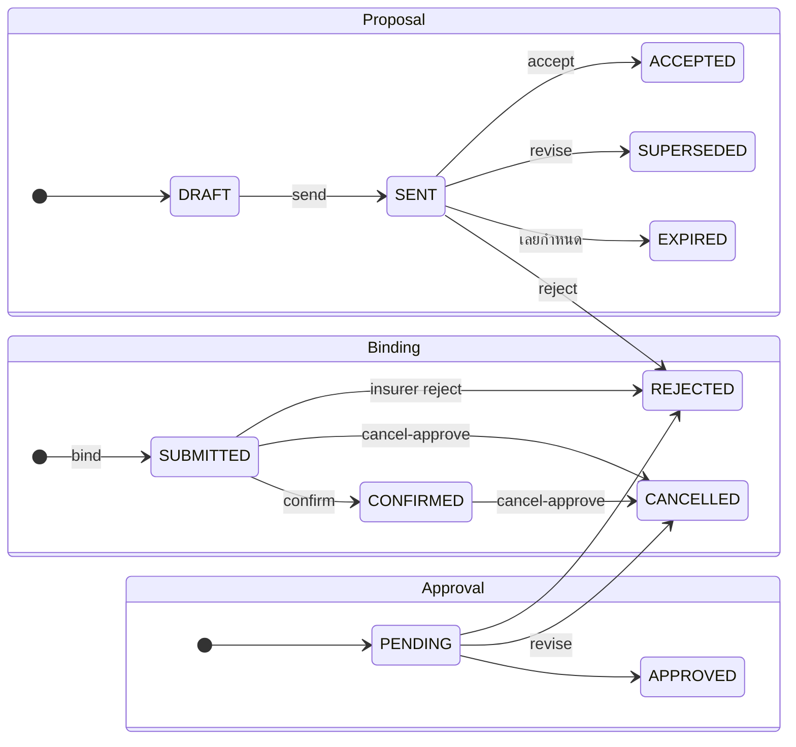
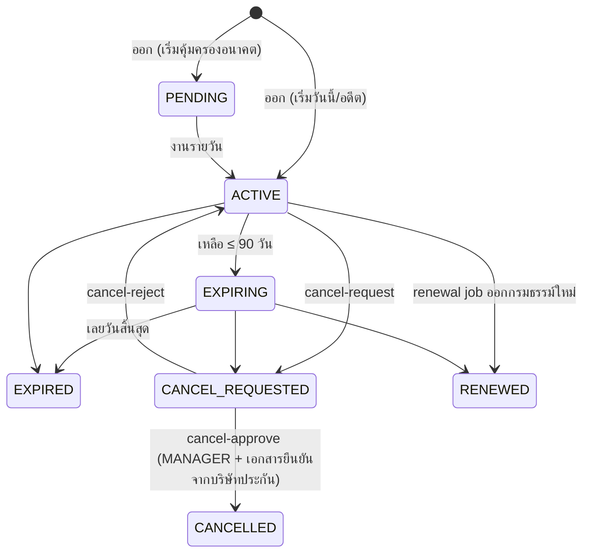
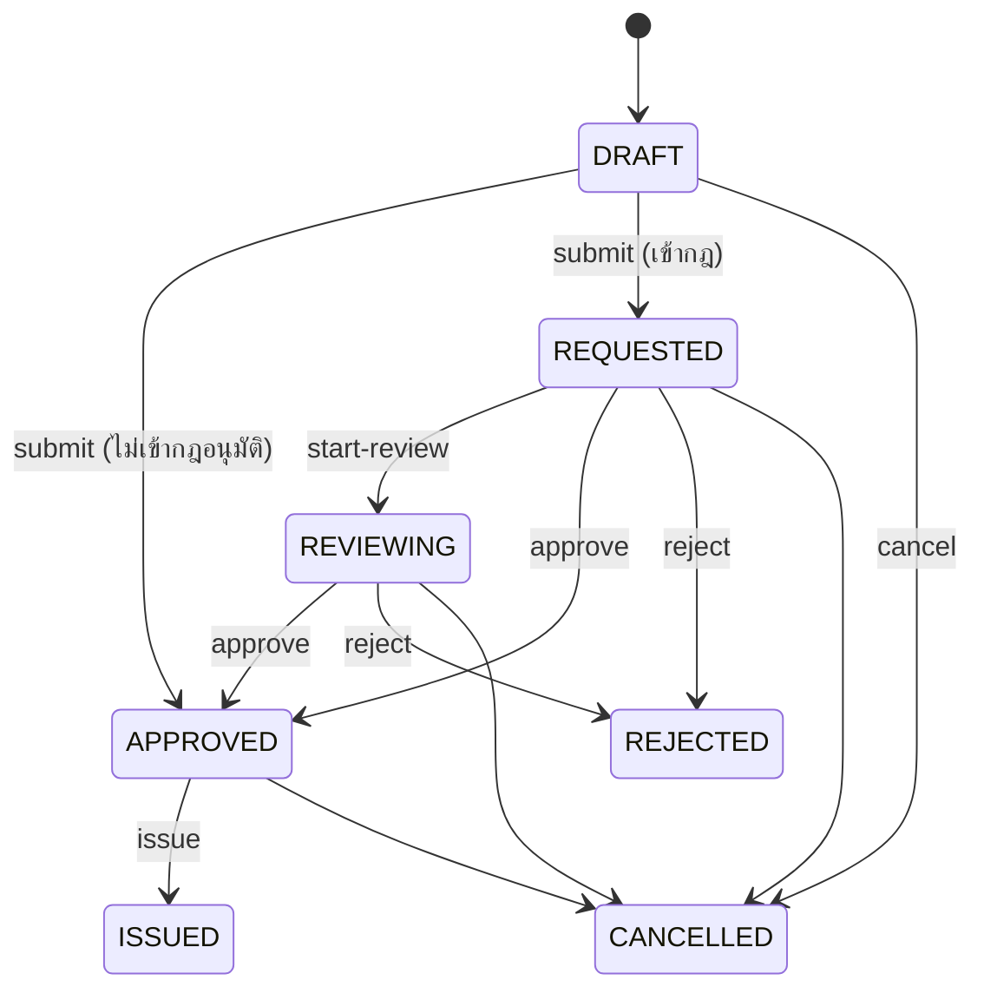
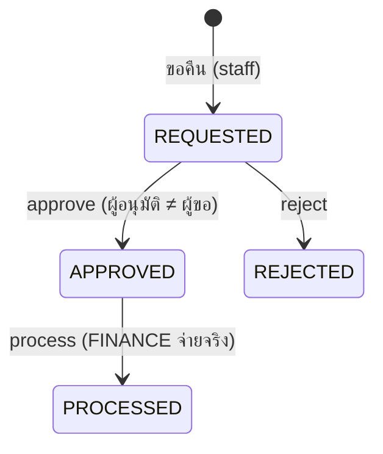
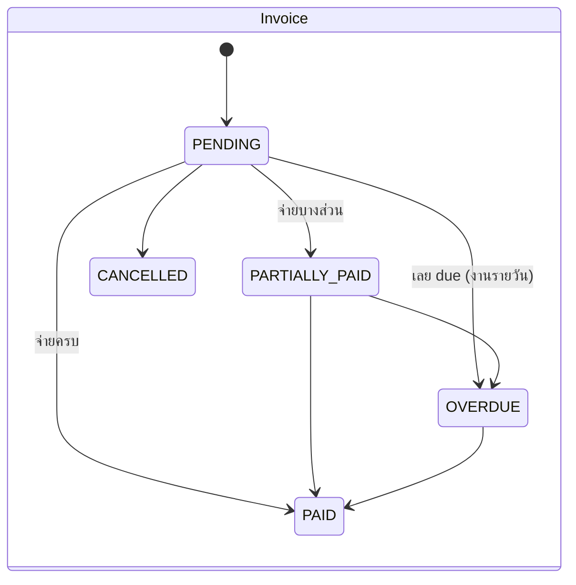
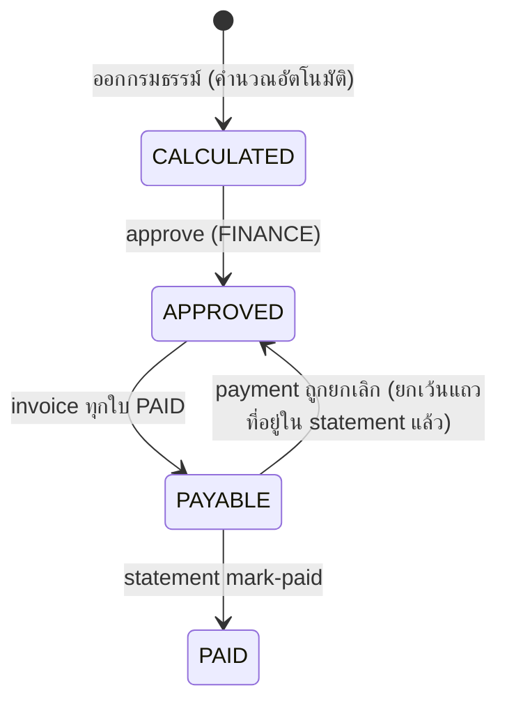

# Flow การทำงานทั้งระบบ — Insurance Opening System V2

> สรุปจาก **โค้ดจริง** ของ backend (state machine, service, permission) ใช้เป็นเอกสารตรวจรับและ onboarding
> สิ่งที่ตรวจอัตโนมัติ: ตาราง permission ในหัวข้อ 7 ถูกสร้างจาก `prisma/seed-data.ts` และมี unit test เทียบกับเอกสารนี้
> (`src/common/docs/system-flow-doc.spec.ts`) — ถ้าแก้สิทธิ์แล้วลืมอัปเดตเอกสาร test จะล้ม
> รายละเอียดเชิงเทคนิค: [DESIGN.md](DESIGN.md) · แผน/การตัดสินใจ: [PLAN_V2.md](PLAN_V2.md) · spec: [Insurance_Broker_Workflow_V2.md](Insurance_Broker_Workflow_V2.md)
> ขอบเขตที่ **ไม่รวมใน v2.0.0:** งานสินไหม (Claim) และ LINE notification (Backlog)

---

## 1. ภาพรวม

| ชั้น | หน้าที่ |
|---|---|
| Frontend (Angular :4200) | แสดงผล ปุ่มแสดงตาม `allowedActions` / permission ที่ backend ส่งมา ไม่ตัดสิน business rule เอง |
| Backend (NestJS :3000/api) | state machine, กติกาธุรกิจ, permission, data scope, audit, transaction |
| ฐานข้อมูล | PostgreSQL — เงิน `Decimal(15,2)` ส่งเป็น string, เวลาเก็บ UTC แสดง `Asia/Bangkok` |
| งานเบื้องหลัง | BullMQ + Redis: อีเมล, งานรายวัน (หัวข้อ 8) · Mailpit :8025 สำหรับทดสอบอีเมล |

กฎที่ห้ามละเมิด (CLAUDE.md): rule/status อยู่ backend, ทุก status change ผ่าน `transition()` + optimistic lock + history + audit,
`@Transactional()` ทุกงานที่เปลี่ยนสถานะ, ไม่ลบข้อมูลธุรกรรมจริง, ทุก route มี `@RequirePermissions`/`@Public`

---

## 2. Job — สายงานขาย

state machine เต็มและตาราง action → transition อยู่ที่ [DESIGN.md §7](DESIGN.md) — สรุป:

- ยกเลิก: ก่อน `BINDING` → `cancel` ได้ทันที; ตั้งแต่ `BINDING` / `POLICY_PENDING` ต้อง `cancel-request` → MANAGER `cancel-approve` / `cancel-reject` (D-26)
- Job ต่ออายุ (renewal job) ใช้ state machine เดียวกัน และเมื่อออกกรมธรรม์ → Renewal `RENEWED` + กรมธรรม์เดิม `RENEWED`

## 3. State machine ของเอกสารประกอบ

### Underwriting (ต่อ job, เก็บเป็นรอบ/version)

### Quotation / Proposal / Approval / Binding

- Proposal: ไฟล์ PDF เรนเดอร์สด; ตอน `accept` ต้องเลือกวิธี (EMAIL / SIGNED_DOCUMENT / LINE / MANUAL) และแนบหลักฐานหรือ remark
- Approval Rule (D-8/D-16): `JOB` เบี้ย ≥ 100,000 หรือส่วนลด > 10% → MANAGER · `ENDORSEMENT` เบี้ยปรับ ≥ 10,000 → MANAGER; ไม่เข้ากฎ → อนุมัติอัตโนมัติ

### Document
`REQUIRED → UPLOADED → (UNDER_REVIEW) → VERIFIED | REJECTED → (อัปโหลดใหม่ = version ใหม่)`; เลย `expiryDate` → `EXPIRED` (นับว่าไม่มี) · Submit นับ ≥ UPLOADED, Underwriting/Bind ต้อง VERIFIED (D-22), ห้าม verify เอกสารที่ตัวเอง upload

## 4. กรมธรรม์และงานหลังออก

### Endorsement (สลักหลัง) — ทำได้เฉพาะ Policy ACTIVE / EXPIRING

`issue`: สร้าง `policy_versions` snapshot ก่อนแก้ → apply changes → เบี้ยเพิ่ม = **Debit Note** (invoice) · เบี้ยคืน = **Credit Note** + Refund `REQUESTED` · สร้าง commission adjustment อัตโนมัติ

### Cancellation → Refund
ผลของการยกเลิก (D-17): invoice ที่ due หลังวันยกเลิกและยังไม่จ่าย → `CANCELLED` · เบี้ยคืน → Credit Note + Refund · Commission → adjustment ติดลบตามสัดส่วนเบี้ยที่คืน (clawback) · Renewal ของ policy → `CANCELLED`

### Renewal
`PENDING → IN_PROGRESS → QUOTATION → CUSTOMER_CONTACTED → ACCEPTED → RENEWED` (สถานะตามความคืบหน้าของ renewal job) · `REJECTED` ลูกค้าปฏิเสธ · `LOST` เลยวันหมดอายุโดยไม่ต่อ · `CANCELLED` เมื่อกรมธรรม์ถูกยกเลิก

### Task
`TODO → DONE` หรือ `CANCELLED` (`IN_PROGRESS` มีใน enum แต่ยังไม่มี action); เลย `dueDate` → แจ้งเตือน `TASK_OVERDUE` (งานรายวัน) · งานติดตามต่ออายุสร้างอัตโนมัติที่ 90/60/45/30/15/7 วันก่อนหมดอายุ

## 5. การเงิน

- **Payment** ผูก invoice เท่านั้น (`ACTIVE` / `CANCELLED`); บันทึกแล้วออก **Receipt** (`ISSUED`); ยกเลิก payment → Receipt `VOID` และ invoice คำนวณสถานะใหม่ด้วยฟังก์ชันเดียว (`computeInvoiceStatus`)
- ป้องกันจ่ายซ้ำด้วย `Idempotency-Key` และล็อก invoice ด้วย `SELECT … FOR UPDATE`
- **AR / Aging:** `GET /receivables` แยก NOT_DUE, 0–30, 31–60, 61–90, 90+ ตามวันเลยกำหนด (Asia/Bangkok)

### Commission

สูตร: Gross = เบี้ยสุทธิ × อัตรา · ส่วน Agent / Override หัวหน้าทีม / Broker รวมเท่า Gross เสมอ · WHT หักจากส่วนของผู้รับ — รายละเอียดและ Open Question ที่เกี่ยวข้อง: DESIGN §7.6, PLAN_V2 OQ-15..23
- **Adjustment** (+/−) เป็นแถวใหม่ ไม่แก้แถวเดิม: `PENDING → IN_STATEMENT → SETTLED`
- **Statement** (หนึ่งใบต่อผู้รับต่อเดือน): `DRAFT → CONFIRMED → PAID` หรือ `CANCELLED` (ใบที่จ่ายแล้วยกเลิกไม่ได้); ยอดสุทธิติดลบยืนยันไม่ได้ — adjustment ที่หักไม่พอจะยกไปใบถัดไป

## 6. Data scope (BR-014 / D-21)

| Scope | เห็นอะไร |
|---|---|
| `OWN` (AGENT) | Job ที่ตัวเองเป็น agent |
| `BRANCH` (BROKER_STAFF) | Job ของสาขาตัวเอง และที่ได้รับมอบหมาย |
| `TEAM` (SUPERVISOR, MANAGER) | Job ของตัวเองและลูกทีม (`managerId`) |
| `ALL` (ADMIN, FINANCE, VIEWER) | ทั้งหมด |

ทุก endpoint ที่ผูกกับ Job/Policy/Invoice/Payment/Commission/Endorsement/Refund/Renewal/Document กรองด้วย scope เดียวกัน (`DataScopeService`); Excel export และ dashboard ก็กรองด้วย scope เช่นกัน ·
ผู้รับค่าคอมที่ไม่มี `commission.statement` เห็น/ส่งออกได้เฉพาะ statement ของตัวเอง · ลูกค้า: เห็นเฉพาะที่ตัวเองสร้าง + ลูกค้าของ Job ที่เห็นได้

## 7. Permission matrix

<!-- PERMISSION-MATRIX:START -->
| Permission | ADMIN | AGENT | BROKER_STAFF | SUPERVISOR | MANAGER | FINANCE | VIEWER |
|---|:-:|:-:|:-:|:-:|:-:|:-:|:-:|
| *data scope* | `ALL` | `OWN` | `BRANCH` | `TEAM` | `TEAM` | `ALL` | `ALL` |
| `approval.approve` | ✓ |  |  | ✓ | ✓ |  |  |
| `approval.approve_own` | ✓ |  |  |  |  |  |  |
| `approval.manage` | ✓ | ✓ | ✓ | ✓ | ✓ |  |  |
| `audit.view` | ✓ |  |  |  | ✓ |  |  |
| `commission.adjust` | ✓ |  |  |  |  | ✓ |  |
| `commission.approve` | ✓ |  |  |  |  | ✓ |  |
| `commission.create` | ✓ |  |  |  |  | ✓ |  |
| `commission.rate_view` | ✓ |  | ✓ | ✓ | ✓ | ✓ |  |
| `commission.statement` | ✓ |  |  |  |  | ✓ |  |
| `commission.view` | ✓ | ✓ | ✓ | ✓ | ✓ | ✓ | ✓ |
| `customer.create` | ✓ | ✓ | ✓ | ✓ |  |  |  |
| `customer.delete` | ✓ | ✓ | ✓ | ✓ |  |  |  |
| `customer.update` | ✓ | ✓ | ✓ | ✓ |  |  |  |
| `customer.view` | ✓ | ✓ | ✓ | ✓ | ✓ | ✓ | ✓ |
| `customer.view_sensitive` | ✓ |  |  | ✓ | ✓ |  |  |
| `document.verify` | ✓ |  | ✓ | ✓ | ✓ |  |  |
| `import.create` | ✓ |  | ✓ |  |  |  |  |
| `invoice.update` | ✓ |  | ✓ |  | ✓ | ✓ |  |
| `invoice.view` | ✓ | ✓ | ✓ | ✓ | ✓ | ✓ | ✓ |
| `job.assign` | ✓ |  |  | ✓ | ✓ |  |  |
| `job.cancel` | ✓ | ✓ |  | ✓ | ✓ |  |  |
| `job.create` | ✓ | ✓ |  | ✓ |  |  |  |
| `job.submit` | ✓ | ✓ |  | ✓ |  |  |  |
| `job.update` | ✓ | ✓ | ✓ | ✓ |  |  |  |
| `job.update_all` | ✓ |  | ✓ | ✓ |  |  |  |
| `job.view` | ✓ | ✓ | ✓ | ✓ | ✓ | ✓ | ✓ |
| `job.view_all` | ✓ |  | ✓ | ✓ | ✓ | ✓ | ✓ |
| `maintenance.run` | ✓ |  |  |  |  |  |  |
| `master.manage` | ✓ |  |  |  |  |  |  |
| `notification.view` | ✓ | ✓ | ✓ | ✓ | ✓ | ✓ | ✓ |
| `payment.create` | ✓ |  |  |  |  | ✓ |  |
| `payment.view` | ✓ | ✓ | ✓ | ✓ | ✓ | ✓ | ✓ |
| `policy.create` | ✓ |  | ✓ |  |  |  |  |
| `policy.update` | ✓ |  | ✓ |  | ✓ |  |  |
| `policy.view` | ✓ | ✓ | ✓ | ✓ | ✓ | ✓ | ✓ |
| `proposal.accept` | ✓ | ✓ | ✓ |  |  |  |  |
| `proposal.create` | ✓ | ✓ | ✓ |  |  |  |  |
| `proposal.reject` | ✓ | ✓ | ✓ |  |  |  |  |
| `proposal.revise` | ✓ | ✓ | ✓ | ✓ |  |  |  |
| `proposal.send` | ✓ | ✓ | ✓ |  |  |  |  |
| `proposal.view` | ✓ | ✓ | ✓ | ✓ | ✓ | ✓ | ✓ |
| `quotation.create` | ✓ |  | ✓ |  |  |  |  |
| `quotation.select` | ✓ | ✓ | ✓ | ✓ |  |  |  |
| `quotation.update` | ✓ |  | ✓ |  |  |  |  |
| `quotation.view` | ✓ | ✓ | ✓ | ✓ | ✓ | ✓ | ✓ |
| `receivable.view` | ✓ | ✓ | ✓ | ✓ | ✓ | ✓ | ✓ |
| `renewal.create` | ✓ |  | ✓ |  |  |  |  |
| `renewal.update` | ✓ |  | ✓ |  |  |  |  |
| `renewal.view` | ✓ | ✓ | ✓ | ✓ | ✓ | ✓ | ✓ |
| `report.view` | ✓ |  |  | ✓ | ✓ | ✓ | ✓ |
| `task.create` | ✓ | ✓ | ✓ | ✓ |  |  |  |
| `task.update` | ✓ | ✓ | ✓ | ✓ |  |  |  |
| `task.view` | ✓ | ✓ | ✓ | ✓ | ✓ | ✓ | ✓ |
| `underwriting.review` | ✓ |  | ✓ | ✓ | ✓ |  |  |
| `user.manage` | ✓ |  |  |  |  |  |  |
<!-- PERMISSION-MATRIX:END -->

> สร้างจาก `prisma/seed-data.ts` (`npm run docs:matrix -w apps/api`). ADMIN ใน production ไม่มี `approval.approve_own`

## 8. งานรายวัน (trigger ด้วย cron/BullMQ หรือเรียก endpoint ด้วยมือ)

| งาน | Endpoint | ผล |
|---|---|---|
| Invoice | `POST /invoices/process-daily` | ตั้ง OVERDUE, แจ้ง PAYMENT_DUE / PAYMENT_OVERDUE (ครั้งเดียวต่อ invoice) |
| Policy | `POST /policies/process-daily` | PENDING → ACTIVE → EXPIRING → EXPIRED, แจ้ง POLICY_EXPIRING |
| Renewal | `POST /renewals/process-daily` | สร้าง renewal + task ที่ 90/60/45/30/15/7 วัน, ปิดที่หมดอายุเป็น LOST |
| Task | `POST /tasks/process-daily` | แจ้ง TASK_OVERDUE |
| Quotation / Proposal | `POST /quotations/process-daily`, `/proposals/daily-check` | EXPIRED เมื่อเลยกำหนด |
| Document | `POST /documents/expire-outdated` | EXPIRED เมื่อเลย expiryDate |

อีเมล (BullMQ → SMTP/Mailpit) เฉพาะ Approval Requested, Payment Overdue, Policy Expiring, Task Overdue — ผู้ใช้ปิดรายเหตุการณ์ได้; ที่เหลือเป็น in-app (D-20)

## 9. Checklist ทดสอบ

คำสั่ง (จากรากโปรเจกต์):

| ชุดทดสอบ | คำสั่ง |
|---|---|
| Unit (API) | `npm run test -w apps/api` |
| API e2e (DB `insurance_test`) | `npm run test:e2e -w apps/api` |
| Lint / build | `npm run lint -w apps/api -w apps/web` · `npm run build -w apps/api -w apps/web` |
| Playwright (ต้องรัน `npm run dev` + seed ก่อน) | `npm run e2e -w apps/web` |
| ข้อมูลตัวอย่างครบทุกสถานะ | `npm run db:reset && npm run db:seed:mock` (ผู้ใช้: admin, manager, supervisor, agent01, agent, staff, finance, viewer — รหัสผ่าน `SEED_USER_PASSWORD`) |

ตรวจด้วยมือ (หลัง `db:seed:mock`):

- [ ] **Job:** เห็น Job ครบสถานะ DRAFT → CLOSED, WAITING_INFORMATION, APPROVAL_REJECTED, CANCELLED; timeline มี history ทุก step
- [ ] **Underwriting:** inbox มีรายการ PENDING; มีรอบ INFO_REQUIRED / APPROVED / REJECTED
- [ ] **Quotation:** เปรียบเทียบ 3 บริษัท มี version 2, ถอนข้อเสนอ, เลือกใบที่ถูกที่สุด
- [ ] **Approval:** รายการรออนุมัติ 1 ใบ; ใบที่ถูกปฏิเสธ → resubmit → อนุมัติ
- [ ] **Policy / Invoice:** กรมธรรม์ ACTIVE, PENDING, EXPIRING, EXPIRED, CANCELLED, CANCEL_REQUESTED, RENEWED; invoice PENDING / PARTIALLY_PAID / PAID / OVERDUE / CANCELLED; ดาวน์โหลด PDF ใบแจ้งหนี้และใบเสร็จได้
- [ ] **AR:** `/receivables` มี bucket NOT_DUE และ 0–30; export Excel เปิดได้
- [ ] **Commission:** CALCULATED / APPROVED / PAYABLE / PAID; adjustment PENDING/SETTLED; statement DRAFT / CONFIRMED / PAID / CANCELLED; ผู้รับ (agent01) เห็นเฉพาะใบของตน
- [ ] **Endorsement:** DRAFT, APPROVED, REQUESTED, REVIEWING, ISSUED (มี Debit Note), REJECTED, CANCELLED; policy version > 1
- [ ] **Refund:** REQUESTED / APPROVED / PROCESSED / REJECTED; ผู้อนุมัติ ≠ ผู้ขอ (422 ถ้าคนเดียวกัน)
- [ ] **Renewal / Task:** pipeline มีรายการ, งานเลยกำหนดมีแจ้งเตือน TASK_OVERDUE
- [ ] **Insurer:** `/insurers/:id` — ผู้ติดต่อ (หลัก 1 คน), ผลิตภัณฑ์ + อัตรา, สถิติ (win rate = เลือก ÷ ได้รับราคา)
- [ ] **สิทธิ์:** login เป็น viewer — ไม่มีปุ่มสร้าง/แก้; agent01 ไม่เห็นข้อมูลของ agent; ผู้ไม่มี `report.view` เข้า export/dashboard ไม่ได้ (403)

## 10. ข้อจำกัดที่ทราบ

- ไม่มีงานสินไหม (Claim) และ LINE ใน v2.0.0
- `db:seed:mock` ย้ายเวลาด้วยการแก้วันที่ใน DB เพียงไม่กี่จุด (due date ของ invoice, วันหมดอายุของกรมธรรม์/ใบเสนอราคา, due date ของ task) เพราะระบบเดินตามวันจริง — ทุกจุดมีคอมเมนต์ใน `src/seed-mock/scenarios.ts`
- OQ ที่ตัดสินใจแล้วทั้งหมดอยู่ใน PLAN_V2.md ตาราง Open Questions
